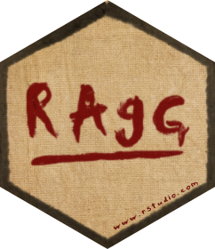

<!-- README.md is generated from README.Rmd. Please edit that file -->

```{r, include = FALSE}
knitr::opts_chunk$set(
  collapse = TRUE,
  comment = "#>",
  fig.path = "man/figures/README-",
  out.width = "100%"
)
```
# ragg <a href='https://ragg.r-lib.org'></a>

<!-- badges: start -->
[](https://travis-ci.org/r-lib/ragg)
[](https://ci.appveyor.com/project/thomasp85/ragg)
[](https://cran.r-project.org/package=ragg)
[](https://www.tidyverse.org/lifecycle/#experimental)
<!-- badges: end -->

This package provides graphic devices for R based on the AGG library developed
by the late Maxim Shemanarev. AGG provides both higher performance and higher
quality than the standard raster devices provided by grDevices. For a comparison
with the default devices, see the
[performance](https://ragg.r-lib.org/articles/ragg_performance.html) and
[quality](https://ragg.r-lib.org/articles/ragg_quality.html) vignettes.

## Installation
The package can be installed from CRAN with `install.packages('ragg')` or, if 
the development version is desired, directly from github:

```{r, eval=FALSE}
# install.packages('devtools')
devtools::install_github('r-lib/ragg')
```

## Use
ragg provides drop-in replacements for the png and tiff graphic devices
provided by default from the grDevices packages and can both produce png and 
tiff files. Notable features, that sets itself apart from the build-in
devices, includes:

- Faster (up to 40% faster than anti-aliased cairo device)
- Direct access to all system fonts
- High quality anti-aliasing
- High quality rotated text
- Support 16-bit output
- System independent rendering (output from Mac, Windows, and Linux should be
  identical)

You can use it like any other device. The main functions are `agg_png()` and
`agg_tiff()`, both have arguments that closely match that of the `png()` and 
`tiff()` functions, so switching over should be easy.

```{r}
library(ragg)
library(ggplot2)

file <- knitr::fig_path('.png')

on_linux <- tolower(Sys.info()[['sysname']]) == 'linux'
fancy_font <- if (on_linux) 'URW Chancery L' else 'Papyrus'

agg_png(file, width = 1000, height = 500, res = 144)
ggplot(mtcars) + 
  geom_point(aes(mpg, disp, colour = hp)) + 
  labs(title = 'System fonts — Oh My!') + 
  theme(text = element_text(family = fancy_font))
invisible(dev.off())

knitr::include_graphics(file)
```

Further, it provides an `agg_capture()` device that lets you access the device
buffer directly from your R session.

```{r}
cap <- agg_capture()
plot(1:10, 1:10)

scatter <- cap()
invisible(dev.off())

plot(as.raster(scatter))
```

## Code of Conduct
Please note that the 'ragg' project is released with a
[Contributor Code of Conduct](https://ragg.r-lib.org/CODE_OF_CONDUCT.html).
By contributing to this project, you agree to abide by its terms.
