# Ragg Quality

``` r
library(ragg)
library(grid)
library(magick)
img_zoom <- function(path) {
  img <- image_read(path)
  img <- image_crop(img, '300x150+150+75')
  img <- image_sample(img, '600x300')
  img
}
```

This vignette tries to compare the quality of the output of ragg, with
that of cairo and, if the system supports it, Xlib (Xlib is unix only).
As quality is, to a certain extend, subjective, the vignette will be
short on conclusions and filled with examples.

> The present version of this vignette has been compiled on a system
> without the X11 device. The benchmarkings will thus omit this device,
> though the text will still refer to it.

## Scope

There are mainly two areas of high importance when discussing graphic
device quality: Shape rendering (fill and stroke) and text rendering.
Both of these are highly dependent on the quality of anti-aliasing if
any. Apart from that we will also look into alpha blending and raster
interpolation.

## Shape rendering

The examples here are relevant for rendering of all different types of
shapes, be it lines or polygons. Lines obviously don’t have fill, so
only the stroke rendering will have relevance here. We chose to use a
circle for this as it provides a nice sampling of uneven edges.

``` r
circle_quality <- function(device, name, file, ...) {
  device(file, width = 600, height = 300, ...)
  grid.circle(
    x = c(0.25, 0.75), 
    r = 0.4, 
    gp = gpar(col = c('black', NA), fill = c(NA, 'black'), lwd = 2)
  )
  grid.text(y = 0.1, label = name, gp = gpar(cex = 2))
  invisible(dev.off())
}
```

``` r
ragg_circle <- knitr::fig_path('.png')

circle_quality(agg_png, 'ragg', ragg_circle)

knitr::include_graphics(ragg_circle)
```

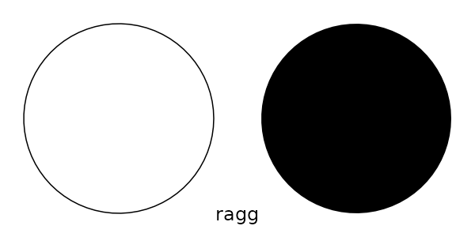

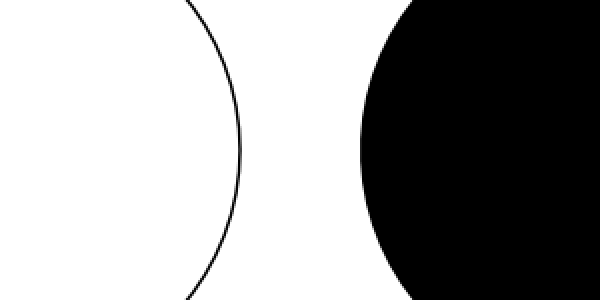

``` r
cairo_none_circle <- knitr::fig_path('.png')

circle_quality(png, 'cairo no AA', cairo_none_circle, 
               type = 'cairo', antialias = 'none')

knitr::include_graphics(cairo_none_circle)
```

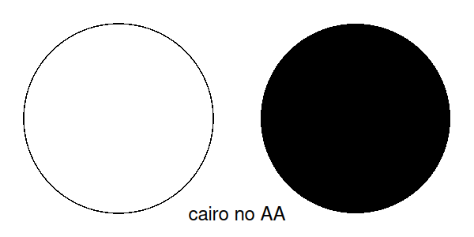

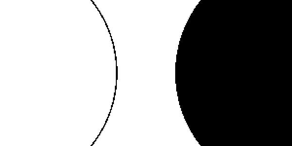

``` r
cairo_gray_circle <- knitr::fig_path('.png')

circle_quality(png, 'cairo gray AA', cairo_gray_circle, 
               type = 'cairo', antialias = 'gray')

knitr::include_graphics(cairo_gray_circle)
```

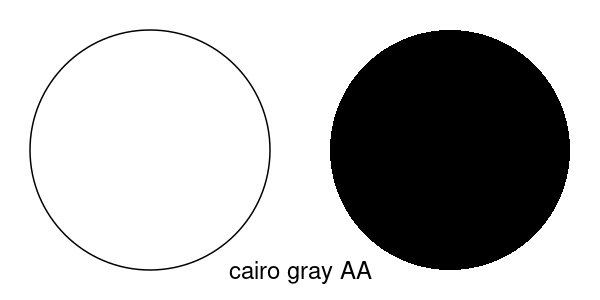


``` r
cairo_subpixel_circle <- knitr::fig_path('.png')

circle_quality(png, 'cairo subpixel AA', cairo_subpixel_circle, 
               type = 'cairo', antialias = 'subpixel')

knitr::include_graphics(cairo_subpixel_circle)
```

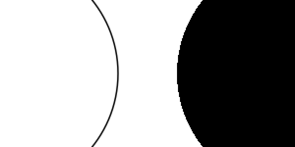


### Observations

ragg is the only device that provides anti-aliasing of fill, which
results in obvious quality differences. The reason for not doing so in
cairo is presumably to avoid artefacts when shapes are touching each
other where anti-aliasing can result in a thin edge between the two
shapes instead of a contiguous colour. This is a real issue, but I
personally don’t agree that it should be allowed to degrade the overall
quality of the device, hence the reason for not following this approach
in ragg.

Xlib (if that is available on your system), provides completely non
anti-aliased output and so does cairo with `antialias = 'none'`. It is
surprising that Xlib appears to have a better stroke rendering than
cairo without anti-aliasing. Further, the difference between `'gray'`
and `'subpixel'` antialiasing is not visible to the naked eye, nor with
a 2x zoom.

## Text

Text is a difficult thing to handle for a graphic device, both in terms
of finding system fonts, and in terms of rendering. Often the rendering
is offloaded to another library (e.g. freetype), which will provide a
bitmap representation to blend into the device. This approach is often
good for horizontal or vertical text, but struggle with other rotations.
Here we will test text rendering at different sizes and at a 27°
counter-clockwise rotation. We will use the the system provided *serif*
font as it provides a more complex task than a *sans-serif* one.

``` r
text_quality <- function(device, name, file, rotation = 0, ...) {
  text <- 'The quick blue R jumped over the lazy snake'
  vp <- viewport(angle = rotation)
  device(file, width = 600, height = 300, ...)
  pushViewport(vp)
  grid.text(text, x = 0.1, y = 0.2, just = 'left', gp = gpar(fontfamily = 'serif', cex = 0.5))
  grid.text(text, x = 0.1, y = 0.4, just = 'left', gp = gpar(fontfamily = 'serif', cex = 1))
  grid.text(text, x = 0.1, y = 0.6, just = 'left', gp = gpar(fontfamily = 'serif', cex = 1.5))
  grid.text(text, x = 0.1, y = 0.8, just = 'left', gp = gpar(fontfamily = 'serif', cex = 2))
  popViewport()
  grid.text(x = 0.9, y = 0.1, label = name, just = 'right', gp = gpar(cex = 2))
  invisible(dev.off())
}
```

``` r
ragg_text <- knitr::fig_path('.png')

text_quality(agg_png, 'ragg', ragg_text)

knitr::include_graphics(ragg_text)
```

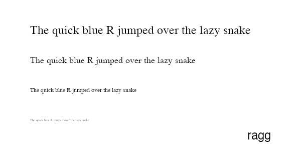

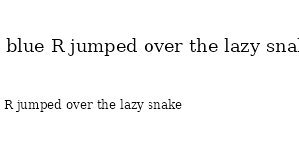

``` r
ragg_text_rot <- knitr::fig_path('.png')

text_quality(agg_png, 'ragg', ragg_text_rot, rotation = 27)

knitr::include_graphics(ragg_text_rot)
```

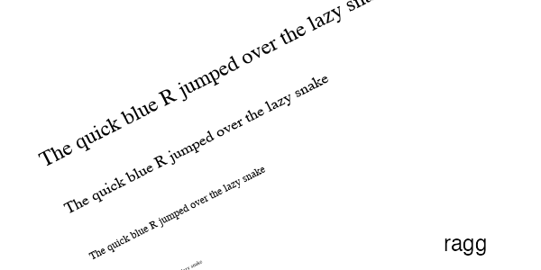

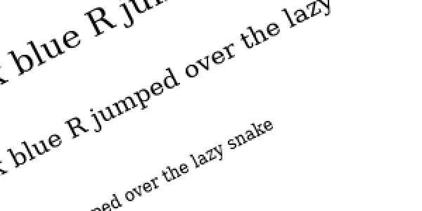

``` r
cairo_none_text <- knitr::fig_path('.png')

text_quality(png, 'cairo no AA', cairo_none_text, 
             type = 'cairo', antialias = 'none')

knitr::include_graphics(cairo_none_text)
```

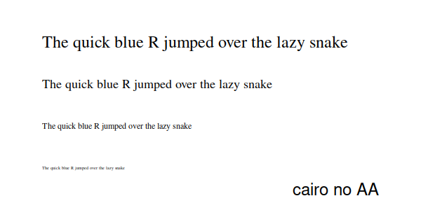

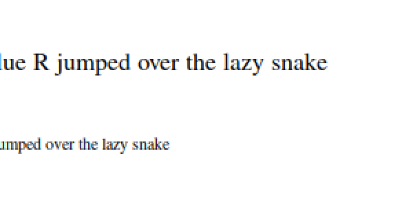

``` r
cairo_none_text_rot <- knitr::fig_path('.png')

text_quality(png, 'cairo no AA', cairo_none_text_rot, rotation = 27, 
             type = 'cairo', antialias = 'none')

knitr::include_graphics(cairo_none_text_rot)
```

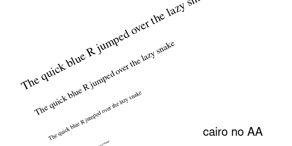

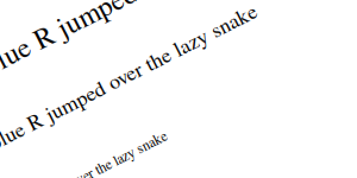

``` r
cairo_gray_text <- knitr::fig_path('.png')

text_quality(png, 'cairo gray AA', cairo_gray_text, 
             type = 'cairo', antialias = 'gray')

knitr::include_graphics(cairo_gray_text)
```

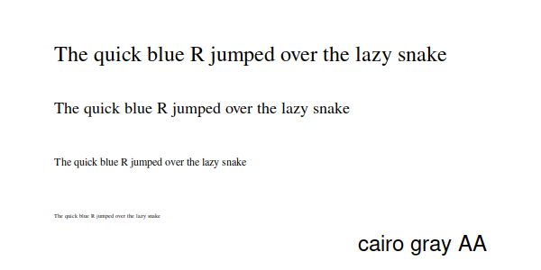


``` r
cairo_gray_text_rot <- knitr::fig_path('.png')

text_quality(png, 'cairo gray AA', cairo_gray_text_rot, rotation = 27, 
             type = 'cairo', antialias = 'gray')

knitr::include_graphics(cairo_gray_text_rot)
```

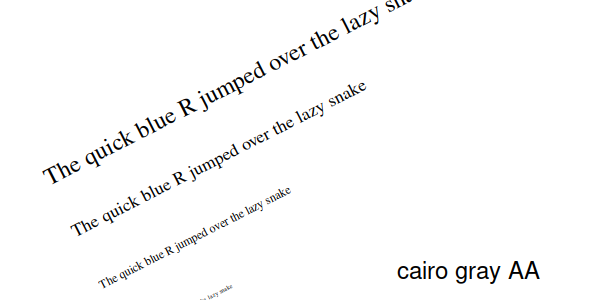


``` r
cairo_subpixel_text <- knitr::fig_path('.png')

text_quality(png, 'cairo subpixel AA', cairo_subpixel_text, 
             type = 'cairo', antialias = 'subpixel')

knitr::include_graphics(cairo_subpixel_text)
```

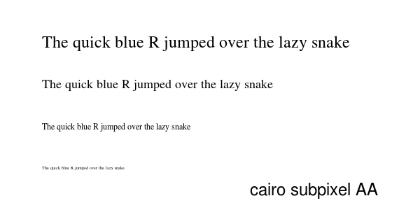


``` r
cairo_subpixel_text_rot <- knitr::fig_path('.png')

text_quality(png, 'cairo subpixel AA', cairo_subpixel_text_rot, rotation = 27, 
             type = 'cairo', antialias = 'subpixel')

knitr::include_graphics(cairo_subpixel_text_rot)
```

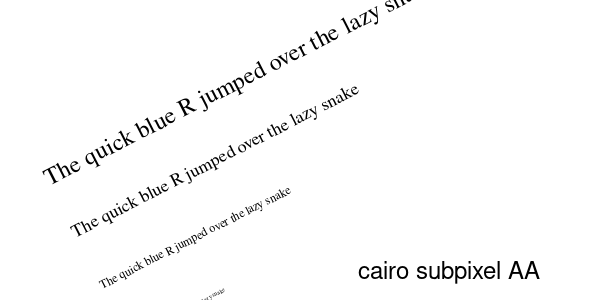


### Observations

Font handling is hard… Setting the font to `'serif'` means different
things to different devices and being more specific results in some
devices not being able to find the font. ragg exclusively uses the
system fonts so whatever your OS defines as the base serif type it will
pick up. Cairo goes through the internal R database to pick a slightly
different font. Xlib… well I can’t comment on what it is doing, but it
appears to pick something completely different from the X11 system.
Regarding quality, I don’t think I have to be mean and mention Xlib, so
let’s look at ragg and cairo. Ignoring for a fact that they have used
two different fonts, we can see some differences and some interesting
stuff. First, cairo don’t care about the anti-alias setting when it
renders fonts. My guess is that it will always ask for an 8-bit pixelmap
from the font engine (probably freetype) and use that. This ensures high
quality fonts no matter the settings. The text appears quite heavy,
which (unless this is a feature of the font) indicates that cairo does
not gamma-correct the pixelmap before blending it into the image.
Correct gamma correction of font is quite important, so if that is the
case it is quite sad. Another thing we notice is that cairo uses the
pixelmaps even for rotated text. This results in jagged baseline and
uneven kerning when plotting rotated text. ragg only uses pixelmaps when
plotting axis-aligned text. For rotated text it will convert the glyphs
to polygons and render them using the built-in rasterizer ensuring an
even baseline and kerning. This means plotting rotated text is slightly
less performant, at the cost of looking good — I can live with that
trade-off.

## Alpha blending

How transparent colours are combined is not necessarily equal among
devices. The biggest divide is on whether to use premultiplied colours
or not. With premultiplied colours the red, green, and blue intensity is
weighted by the alpha directly, instead of alpha simply being an
additional value. Using premultiplied colours is the only way to get
correct alpha blending. As the Xlib device doesn’t support transparent
colours it will be exempt from this comparison even on systems that have
it. Further, as alpha blending is not related to anti-aliasing, we will
simply compare ragg against a single cairo setup.

``` r
blend_quality <- function(device, name, file, ...) {
  device(file, width = 600, height = 300, ...)
  grid.rect(x = 0.35, y = 0.4, width = 0.5, height = 0.5, gp = gpar(fill = '#FF0000'))
  grid.rect(x = 0.65, y = 0.6, width = 0.5, height = 0.5, gp = gpar(fill = '#00FF001A'))
  grid.text(x = 0.9, y = 0.1, label = name, just = 'right', gp = gpar(cex = 2))
  invisible(dev.off())
}
```

``` r
ragg_blend <- knitr::fig_path('.png')

blend_quality(agg_png, 'ragg', ragg_blend)

knitr::include_graphics(ragg_blend)
```


``` r
cairo_blend <- knitr::fig_path('.png')

blend_quality(png, 'cairo', cairo_blend, type = 'cairo')

knitr::include_graphics(cairo_blend)
```

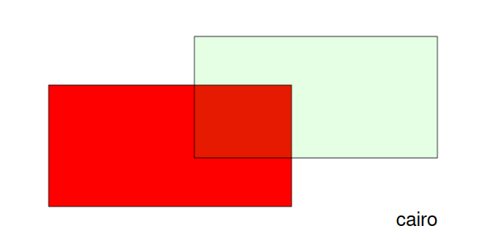

### Observations

Nothing much to say — both devices handle alpha blending correctly (see
[here](https://developer.nvidia.com/content/alpha-blending-pre-or-not-pre)
to understand what this test was about).

## Raster

The main way raster plotting can get influence by the device is in how
the image gets interpolated during scaling, which will be briefly
compared here.

``` r
raster_quality <- function(device, name, file, ...) {
  reds <- matrix(hcl(0, 80, seq(50, 80, 10)),
                        nrow = 4, ncol = 5)
  device(file, width = 600, height = 300, ...)
  grid.raster(reds, vp = viewport(0.25, 0.25, 0.5, 0.5, angle = 27))
  grid.raster(reds, interpolate = FALSE, 
              vp = viewport(0.75, 0.75, 0.5, 0.5, angle = 27))
  grid.text(x = 0.9, y = 0.1, label = name, just = 'right', gp = gpar(cex = 2))
  invisible(dev.off())
}
```

``` r
ragg_raster <- knitr::fig_path('.png')

raster_quality(agg_png, 'ragg', ragg_raster)

knitr::include_graphics(ragg_raster)
```

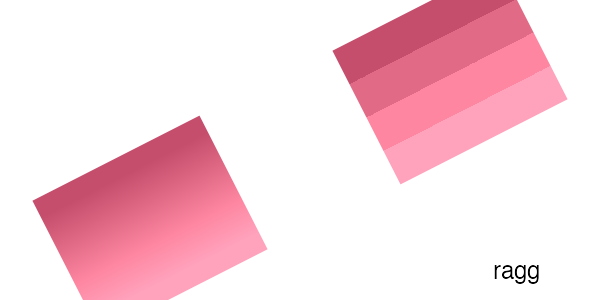

``` r
cairo_raster <- knitr::fig_path('.png')

raster_quality(png, 'cairo', cairo_raster, type = 'cairo')

knitr::include_graphics(cairo_raster)
```

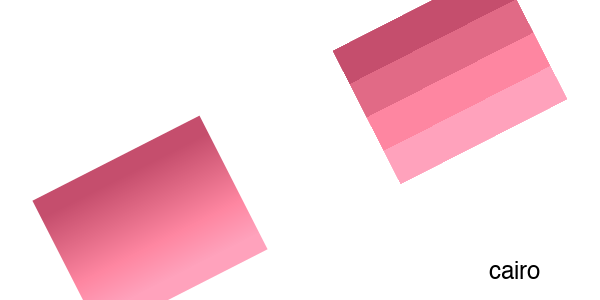

### Observations

As with blending there is nothing much to see here. All devices perform
equally and correctly.

## Conclusion

When it comes to raster quality, the only real contenders are ragg and
anti-aliased cairo, as lack of anti-aliasing has clear detrimental
effect on output quality. As there appears to be no real difference in
quality between cairo’s two anti-aliasing modes, the question basically
boils down to cairo vs ragg. While for the most part the two rendering
systems provide comparable output, there are two areas where ragg takes
the lead, quality-wise: rendering of fill, and rendering of rotated
text. If these areas are of interest to you then ragg will be the
obvious choice.

## Session info

``` r
sessioninfo::session_info()
#> ─ Session info ──────────────────────────────────────────────────────
#>  setting  value
#>  version  R version 4.5.2 (2025-10-31)
#>  os       Ubuntu 24.04.3 LTS
#>  system   x86_64, linux-gnu
#>  ui       X11
#>  language en
#>  collate  C.UTF-8
#>  ctype    C.UTF-8
#>  tz       UTC
#>  date     2026-03-06
#>  pandoc   3.1.11 @ /opt/hostedtoolcache/pandoc/3.1.11/x64/ (via rmarkdown)
#>  quarto   NA
#> 
#> ─ Packages ──────────────────────────────────────────────────────────
#>  package     * version date (UTC) lib source
#>  bslib         0.10.0  2026-01-26 [1] RSPM
#>  cachem        1.1.0   2024-05-16 [1] RSPM
#>  cli           3.6.5   2025-04-23 [1] RSPM
#>  desc          1.4.3   2023-12-10 [1] RSPM
#>  digest        0.6.39  2025-11-19 [1] RSPM
#>  evaluate      1.0.5   2025-08-27 [1] RSPM
#>  fastmap       1.2.0   2024-05-15 [1] RSPM
#>  fs            1.6.6   2025-04-12 [1] RSPM
#>  htmltools     0.5.9   2025-12-04 [1] RSPM
#>  jquerylib     0.1.4   2021-04-26 [1] RSPM
#>  jsonlite      2.0.0   2025-03-27 [1] RSPM
#>  knitr         1.51    2025-12-20 [1] RSPM
#>  lifecycle     1.0.5   2026-01-08 [1] RSPM
#>  magick      * 2.9.1   2026-02-28 [1] RSPM
#>  magrittr      2.0.4   2025-09-12 [1] RSPM
#>  pkgdown       2.2.0   2025-11-06 [1] RSPM
#>  R6            2.6.1   2025-02-15 [1] RSPM
#>  ragg        * 1.5.1   2026-03-06 [1] local
#>  Rcpp          1.1.1   2026-01-10 [1] RSPM
#>  rlang         1.1.7   2026-01-09 [1] RSPM
#>  rmarkdown     2.30    2025-09-28 [1] RSPM
#>  sass          0.4.10  2025-04-11 [1] RSPM
#>  sessioninfo   1.2.3   2025-02-05 [1] RSPM
#>  systemfonts   1.3.1   2025-10-01 [1] RSPM
#>  textshaping   1.0.4   2025-10-10 [1] RSPM
#>  xfun          0.56    2026-01-18 [1] RSPM
#>  yaml          2.3.12  2025-12-10 [1] RSPM
#> 
#>  [1] /home/runner/work/_temp/Library
#>  [2] /opt/R/4.5.2/lib/R/site-library
#>  [3] /opt/R/4.5.2/lib/R/library
#>  * ── Packages attached to the search path.
#> 
#> ─────────────────────────────────────────────────────────────────────
```
